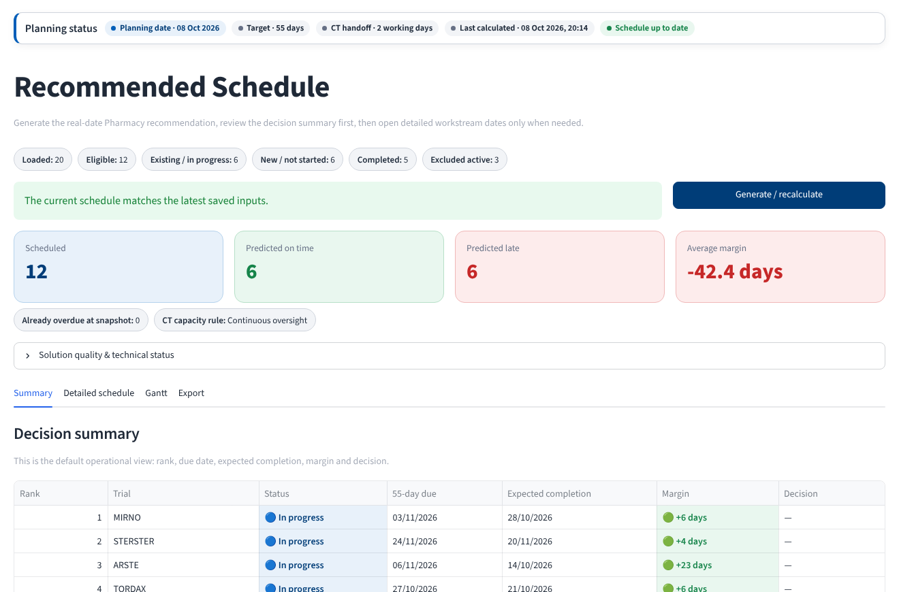
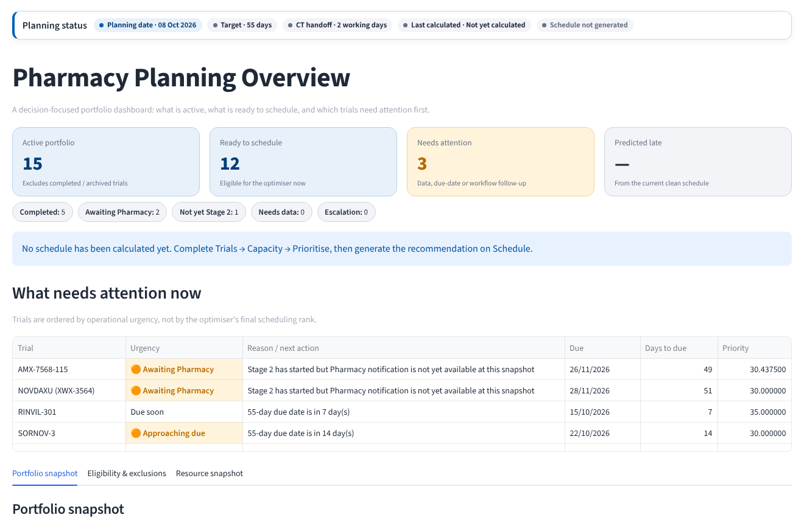
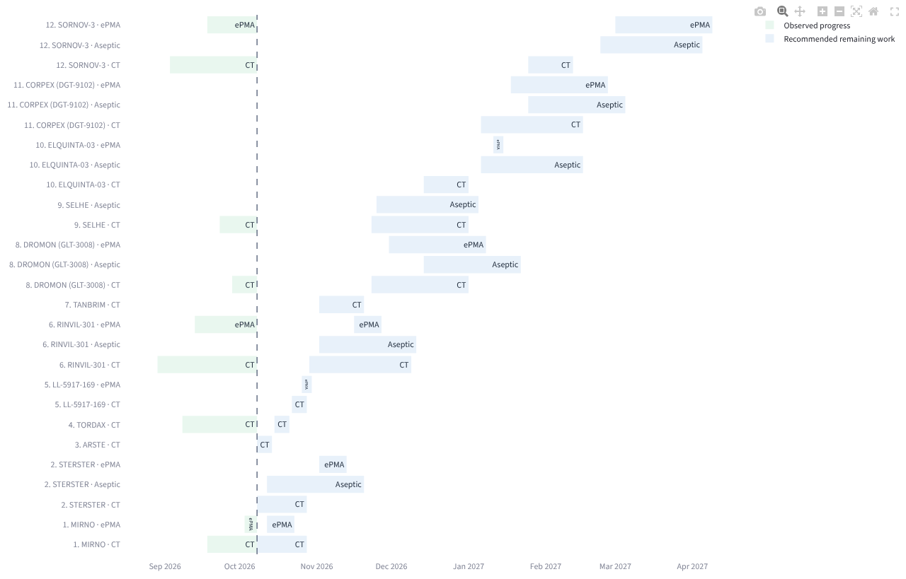
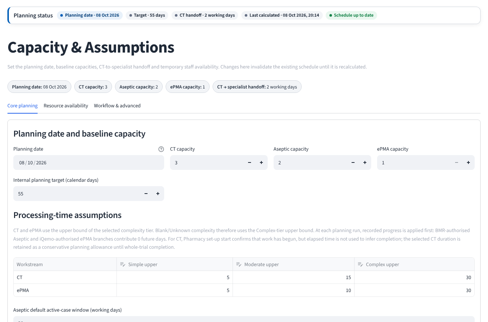

# Clinical Trial Pharmacy Set-up Scheduler

A Streamlit planning tool that helps a hospital pharmacy decide **which clinical trials to set up next, and when**, so more trials meet their set-up target with the staff available.

It combines a constraint-programming optimiser (Google OR-Tools CP-SAT) with a simple, step-by-step interface that non-technical pharmacy staff can use without writing code.

**Live demo:** [nhs-trial-setup-scheduler.streamlit.app](https://nhs-trial-setup-scheduler.streamlit.app) — click **Load synthetic sample data** on the first page to try it.



---

## The problem

Before a clinical trial can open, the hospital pharmacy has to set it up: the clinical trials team prepares the trial, and some trials also need aseptic (sterile preparation) work and an electronic prescribing (ePMA) build. Each workstream has limited staff, the trials compete for the same people, and each trial has a target date for completion.

The question is not just "how long does each trial take?" but **"given limited capacity, what order and timing gets the most trials done on time, and which ones should we escalate?"**

## What the tool does

| Page | Purpose |
|---|---|
| **Overview** | Active portfolio, trials ready to schedule, what needs attention now (due soon, awaiting notification, missing data) |
| **Trials** | Upload any tracker workbook (Excel/CSV). Sheet, header row and column names are detected automatically and confirmed by the user. Data-quality checks flag gaps |
| **Capacity** | Planning date, staff capacity per workstream, processing-time assumptions by complexity, temporary capacity reductions (e.g. leave, training) |
| **Prioritise** | Review priority scores and, if needed, manually move a trial up or down the queue |
| **Schedule** | Run the optimiser and get a recommended start/finish date for every workstream, with predicted on-time / late status, a Gantt chart and Excel export |
| **Review** | Record final decisions and download a backup of the workspace |





## How the optimisation works

Each trial is broken into up to three workstreams (clinical trials team, aseptic, ePMA), each with its own capacity limit. The CP-SAT model schedules them on a working-day calendar and solves in two stages:

1. **Maximise the number of trials finishing on time.**
2. Keeping that number fixed, **minimise priority-weighted lateness**, where a trial's weight rises with its organisational priority and with how much of its target window has already been used.

Rules reflect how the work actually happens: specialist work starts a set number of working days after the clinical trials work begins, completed milestones remove that workload from future demand, and unknown complexity is treated conservatively (upper-bound duration) rather than guessed.

In my MSc dissertation evaluation on historical data, this approach reduced total delay by **10.0%**, and scenario analysis showed the number of on-time trials could rise from **3 to 7 out of 18** under different capacity assumptions.



## Data and privacy

- **This repository contains no real hospital data.** The demo uses a synthetic portfolio of 20 fictitious trials (`sample_data.py`), generated relative to today's date so it always looks current.
- Default capacities and processing times are illustrative and can be changed on the Capacity page.
- In the public demo, nothing is written to the server. Set `PUBLIC_DEMO=0` to enable local autosave and named checkpoints when running on your own machine.
- `.gitignore` excludes Excel/CSV files and saved workspaces so real tracker data is never committed by accident.

## Run it locally

```bash
git clone https://github.com/<your-username>/<repo-name>.git
cd <repo-name>
pip install -r requirements.txt
streamlit run app.py
```

Then open the Overview page and click **Load synthetic sample data**, or upload `sample_data/sample_trials.xlsx` on the Trials page to see the upload and column-mapping flow.

Requires Python 3.11+.

## Project structure

```
app.py                 # Entry point and page navigation
nhs_core.py            # Data loading, column mapping, operational rules, state
nhs_solver.py          # Prepares solver input and post-processes results
scheduler_engine.py    # CP-SAT optimisation model
ui_components.py       # Shared layout and styling
sample_data.py         # Synthetic demo portfolio
pages/                 # One file per page in the app
sample_data/           # Example workbook for testing the upload flow
```

## Tech stack

Python · Streamlit · Google OR-Tools (CP-SAT) · pandas · Plotly · openpyxl

## About

Built by **Inseo Lee** as part of an MSc Business Analytics (Operational Research and Risk Analysis) dissertation at the University of Manchester, in partnership with an NHS hospital trust. I designed the optimisation model, the operational rules and the interface, and delivered the tool to pharmacy staff with a user guide and live demonstration.
